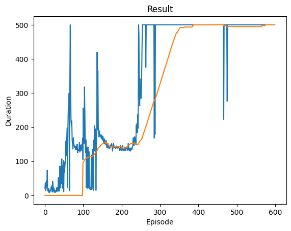

Part B: DQN Implementation
Skim the CartPole documentation:
https://docs.pytorch.org/tutorials/intermediate/reinforcement_q_learning.html
Cart pole documentation:
https://gymnasium.farama.org/environments/classic_control/cart_pole/

Follow the PyTorch DQN tutorial implementation, but comment each major block of code with plain-English explanations of what’s happening (e.g., “This section chooses actions using an epsilon-greedy policy”).

The reward curve.

Notes on when the policy seems to stabilize.

Screenshots of the policy visualization (code provided).

Run a training sequence with DQN and record:

Deliverable: Annotated code + plots.

## DQN: Code Comments

See DDQN.ipynb for comments

## DQN: Training Plot
