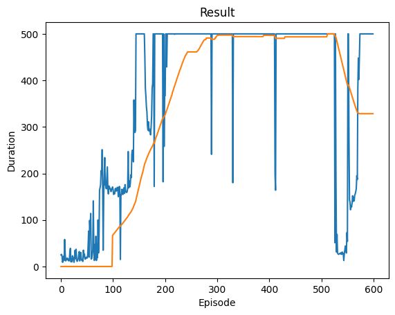

Part C: Double DQN
Modify your implementation to support Double DQN (hint: the change is in how you select vs evaluate the max-Q action)

Train and compare results between DQN and Double DQN.

Plot both reward curves on the same chart.

Deliverable: Updated code + comparison plots + short explanation of differences.

## DDQN: Update to Support DDQN 

Made the following adjustments in DDQN.ipynb in `optimize_model_ddqn()`:
```
with torch.no_grad():
    # Use policy_net to choose best action for next states
    next_state_actions = policy_net(non_final_next_states).max(1).indices

    # Use target_net to evaluate those chosen actions
    next_state_values[non_final_mask] = (
        target_net(non_final_next_states)
        .gather(1, next_state_actions.unsqueeze(1))
        .squeeze(1)
    )
```

## DDQN: Comparison Plots

DQN on the left. DDQN on the right.




## DDQN: 

The DQN begins to stablize in the late 200's while the DDQN begins to stablize around the early 200's. Also, there appears to be slightly less noise in the DDQN training than the DQN's. Could be chance, but based off of how DDQN is designed its likely to be more stable.
